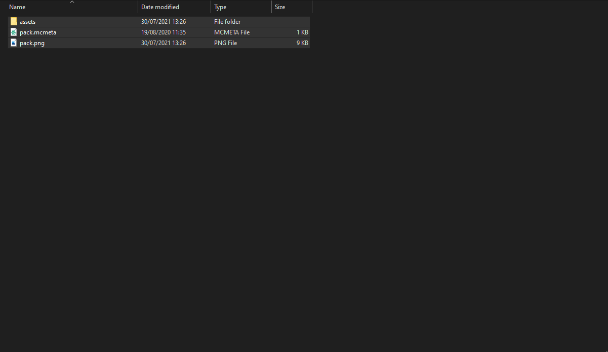
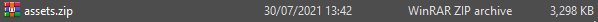
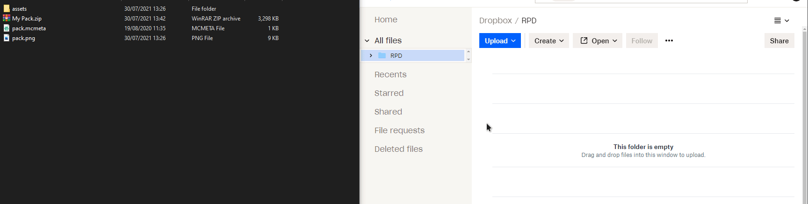
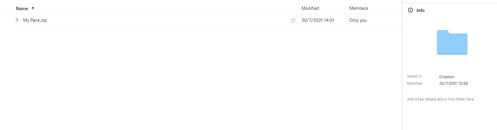
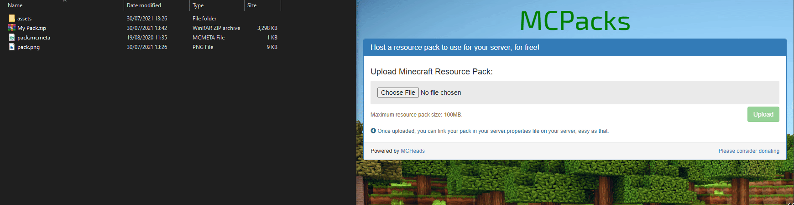
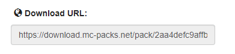

# Step 1: Prepairing Resource Pack

### 1.1 Preparing Your Resource Pack File:

Let's get your Resource Pack ready to be uploaded to the host of your choice.

#### Step 1: Open your resource pack folder

navigate to your resource pack and open it, you should now see something like Ref.1

#### Step 2: Zip up your file

zip up your file. See Ref.2 if you are unsure of how to do this.\
After you have zipped up your Resource Pack rename the .zip file to whatever name you wish (Ref. 3)

### 1.2 Uploading Your Resource Pack:

Setting up your resource pack is a pretty straightforward process, but with so many hosts to choose from what exactly do you choose? From experience, I would recommend a host like [https://mc-packs.net/](https://mc-packs.net) or [https://dropbox.com/](https://dropbox.com)

#### Step 1: Upload your resource pack zip



#### Step 1: log in to your dropbox panel

Go to [https://www.dropbox.com/](https://www.dropbox.com) and create an account/sign in

#### Step 2: Upload your server's file

Drag and drop your zip file into the file manager section of the Dropbox panel to upload your file (Ref. 4)

#### Step 3: Get your download link

hover over the file in your dropbox file and click the copy link button (Ref. 5)


Now you have your download link keep it in a safe place as you will need it later.




#### Step 1: Go to the MC-Packs website

Open [https://mc-packs.net/](https://mc-packs.net)

#### Step 2: Upload your file

drag and drop your file onto the Choose File button and click the big green upload button (Ref. 4)

#### Step 3: Get your download link

Copy the download link from the **Download URL:** section (Ref.5)


Now you have your download link keep it in a safe place as you will need it later.





If you have your **own website** set up for your **Minecraft server** you can create a direct download link and host it directly on **your website** (this is the more complicated option and I won't be going through how to do this on this wiki)




